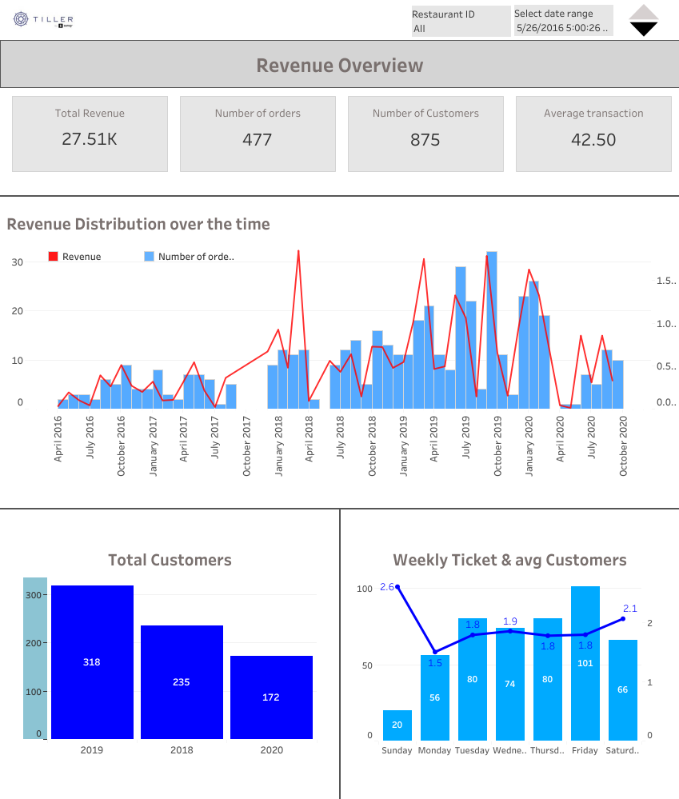

# Tiller by SumUp


Restaurant sales analytics using Python and Tableau to uncover revenue trends, payment behaviour, and product performance insights.

## 📊 Executive Summary

- Built an end-to-end restaurant sales analytics pipeline covering data cleaning, transformation, and dashboard development using Python and Tableau
- Identified key revenue drivers across time, payment methods, and product categories
- Developed an interactive Tableau dashboard for business insights

## 📌 Project Overview

This project analyses restaurant transaction data from Tiller by SumUp to uncover revenue trends, payment behaviour, and product performance using Python and Tableau.

The analysis combines Python-based data cleaning and preparation with Tableau visualisation to provide business owners with an intuitive dashboard for monitoring sales performance and identifying growth opportunities.

The dashboard focuses on:

- Revenue analysis
- Payment method performance
- Product category insights

---

## 🧠 Key Insights

- Revenue shows clear variation across different time periods, indicating seasonal and operational effects.
- Card payments dominate total transactions, indicating strong customer preference for digital payments.
- Certain product categories generate a disproportionate share of revenue.
- Peak sales occur during specific hours, highlighting time-based demand patterns.
- Product-level analysis highlights opportunities for menu optimisation.

---

## 📊 Tableau Dashboard

The interactive Tableau dashboard is available below:

<!-- 👉 View [Dashboard](https://public.tableau.com/app/profile/chirag.arya4385/viz/TillerbySumUp/Dashboard1) -->

<p align="center">
  <a href="https://public.tableau.com/app/profile/chirag.arya4385/viz/TillerbySumUp/Dashboard1">
    
  </a>
</p>

---

## 📊 Analysis Performed

The analysis focuses on understanding revenue performance, customer payment behaviour, and product profitability to help restaurant owners make informed business decisions.

### Revenue Analysis
- Revenue trends over time
- Peak sales periods

### Payment Analysis
- Payment method distribution
- Payment performance comparison

### Product Analysis
- Product category performance
- Best-selling products
- Revenue contribution by category

---

## 🧹 Data Preparation

Data cleaning was performed using Python and included:

- Missing value treatment
- Data validation
- Data type standardisation
- Formatting corrections
- Dataset merging

---

## 📂 Dataset Information

The dataset consists of four business data tables:

- Order Data
- Order Line Data
- Payment Data
- Store Data

The data contains restaurant transaction records captured between **26 May 2016** and **11 October 2020**.

These datasets were combined to analyse revenue trends, payment behaviour, and product performance.

---

## 🛠️ Tools & Technologies

- Python (Pandas, NumPy)
- Jupyter Notebook
- Google Colab
- Tableau

---

## 📁 Repository Structure

```text
Tiller-by-Sumup/
│
├── Data_files/
│
├── Media/
│   └── Dashboard.png
│
├── notebooks/
│   └── tiller_data_cleaning.ipynb
│
├── tableau/
│   └── Tiller.twbx
│
└── README.md
```

---

## 💡 Business Recommendations

- Focus marketing efforts during peak revenue periods
- Promote top-performing products more prominently
- Encourage preferred payment methods through targeted offers
- Optimise underperforming product categories

---

## 🚀 Business Impact

This project helps businesses:

- Monitor revenue performance
- Understand customer payment preferences
- Identify top-performing products
- Optimise menu and pricing strategies
- Support data-driven business decisions

---

## 🚀 Future Improvements

- Automate dashboard refresh processes
- Incorporate forecasting models
- Develop customer segmentation analysis
- Add profitability analysis by product category

---

## 👤 Author

**Chirag Arya**

GitHub: [AryaChirag](https://github.com/AryaChirag)

LinkedIn: [Chirag Arya](https://www.linkedin.com/in/chiragarya/)

-----

⭐ If you found this project interesting, feel free to explore the repository and connect with me on LinkedIn.
